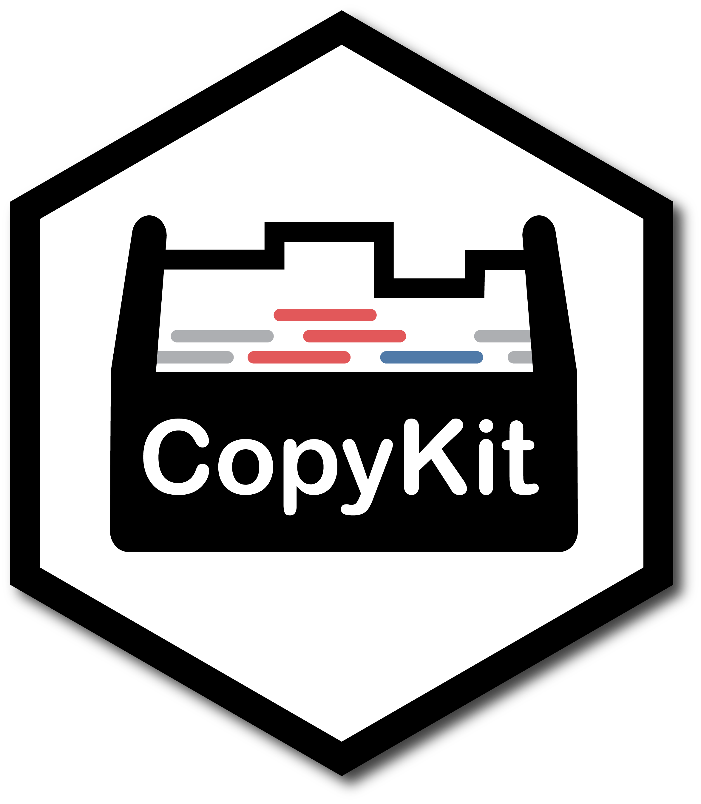

<!-- README.md is generated from README.Rmd. Please edit that file -->

# CopyKit

<!-- badges: start -->
<center>

</center>
<!-- badges: end -->

*CopyKit* provides a suite of tools for pre-processing, quality control,
analysis, and visualization of single cell whole genome DNA sequencing
datasets.

## Installation

You can install the development version of CopyKit from github with:

``` r
devtools::install_github("navinlabcode/copykit")
```

## Tutorial

The complete documentation can be found at:
<https://navinlabcode.github.io/CopyKit-UserGuide/>
