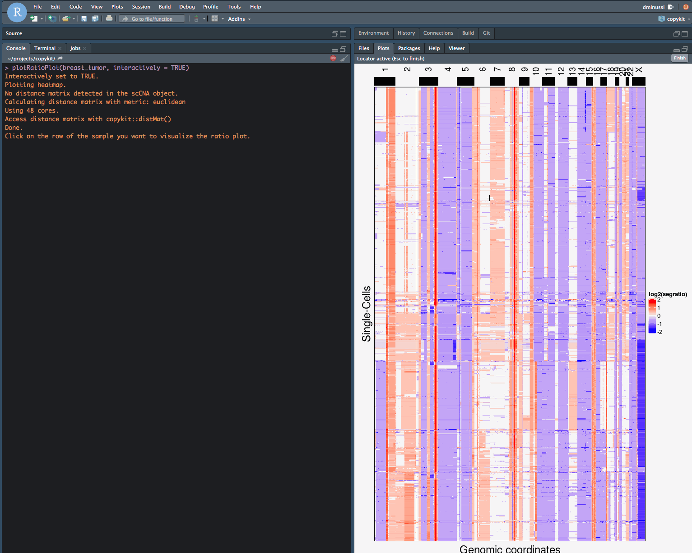

  **CopyKit** provides a toolkit for the analysis of single-cell copy number datasets. It includes functions to read data from [Varbin](https://www.ncbi.nlm.nih.gov/pmc/articles/PMC4417119/) or [10X CNA datasets](https://www.10xgenomics.com/solutions/single-cell-cnv/).
  
  A common workflow with **CopyKit** consists in reading the dataset and using to filter the noisy cells out, clustering and plotting heatmaps for further analysis.


## Installation

You can install the development version of CopyKit from github with:

``` {}
devtools::install_github("navinlabcode/copykit")
```


```{r setup, include = FALSE}
library(copykit)
```

CopyKit requires instalattion of the `leidenbase` package from Cole Trapnell lab. please install with prior to using CopyKit.
```{r eval = FALSE}
devtools::install_github('cole-trapnell-lab/leidenbase')
```


## Running VarBin

CopyKit workflows start from using **.bam** files as input. CopyKit will count the reads that align within the pre-determined bins from the VarBin pipeline, excluding reads marked as duplicates. `copykit::runVarbin` creates an S4 class `scCNA` where all of the bin counts will be stored and it can be run with genome assembly *hg38* or *hg19*

The genomic ranges is stored as a GRanges object containing chromosome number, start coordinate, end coordinate and absolute genomic position, as well as metadata for each bin from the VarBin pipeline. Each row represents the coordinates for one bin.

After `runVarbin()` The scCNA object will contain a matrix of bincounts that can be accessed with `copykit::bin_counts()`. Each bin is row and each sample (cell) is a column. Cells with extremely low bincounts will be automatically filtered out.

It is possible to exclude the information from ChrY (important when working with XX samples) by setting the argument `remove_Y` to `TRUE`. Ex: `readVarbinCNA("~/path_to_varbin_output/", remove_Y = TRUE)`.

``` {r reading_data, eval = FALSE, warning=FALSE}
breast_tumor <- copykit::runVarbin("~/PATH/TO/BAM/",
                                   genome = "hg38",
                                   remove_Y = TRUE)
```

```{r echo = FALSE, warning=FALSE}

```

A quick view on the object:
```{r viewing_object}
breast_tumor
```

And the bin information that can be accessed with `SummarizedExperiment::rowRanges()`:

```{r rowRanges}
SummarizedExperiment::rowRanges(breast_tumor)
```

## Variance Stabilization Transformation

The negative binomial nature of the data leads to overdispersion at the higher levels counts, for this reason it is advisable to perform a variance stabilization transformation. Copykit performs a simple transformation with the freeman-tukey transformation. This step is not necessary but leads to improved sample clustering and better copy number calls at high level amplifications.

```{r vst}
breast_tumor <- runVst(breast_tumor)
```

## Calculating ratios

After `runVarbin()` we can use the bincounts data to calculate ratios. It is possible to select the assay that will be used to calculate the ratios. For this tutorial we use the variance stabilized transformed bincounts by setting the argument assay to 'vst'. To use the original bincount matrix the argument assay can be set to 'bin_counts'. `calcRatios()` will store the calculated ratios within the scCNA object, which can be accessed with `ratios()`

```{r}
breast_tumor <- calcRatios(breast_tumor, assay = "vst")
breast_tumor
```

Finally, we can run a segmentation algorithm to find copy number segments. This can be achived with `runSegmentation()`. By default, CopyKit uses the CBS algorithm from the package `DNAcopy`. The resulting segmentation will be stored in the slot **segment ratios** that can be accessed with `copykit::segment_ratios()`.

The segment_ratios slot will be used for downstream analysis

```{r}
breast_tumor <- runSegmentation(breast_tumor, genome = "hg38")
breast_tumor
```


## Obtain metrics
**Copykit** can provide some quick metrics about the data. That can be done with `copykit::runMetrics()`. It returns informative plots regarding the data

- Root Mean Squared Error: calculated from the distance of each bin to the segment. Which can be used as a way to evaluated the overdispersion and overall noise of the sample
- Total reads: Total read counts for each cell.
- PCR duplicates: Percentage of reads that are PCR duplicates for each cell.
- Breakpoint count: Counts the number of breakpoints per chromosome and sums it up for every cell.

All the information is stored as metadata and can be accessed with `SummarizedExperiment::colData()`.

```{r run_metrics}
breast_tumor <- copykit::runMetrics(breast_tumor)
```

After the information is calculated and saved in the scCNA object it can be visualized with `copykit::plotMetrics()`
```{r plot_metrics}
copykit::plotMetrics(breast_tumor)
```

`copykit::plotMetrics()` can color information according to any column available in the metadata.
```{r plot_metrics_label}
copykit::plotMetrics(breast_tumor,
                     label = "rmse")
```

You can also use the metrics in the metadata to filter the cells if desired.

## Filtering cells.

Cells with low quality can be easily filtered with `filterCells()`.

`filterCells()` uses a k-nearest-neighbor approach to remove cells with random CNA profiles, largely due to noise.

By default, **CopyKit** automatically outputs a heatmap so you can visually assess if the filtering performed as expected, this however can be turned off by adding the argument `filterCells(scCNA, plot_heatmap = FALSE)`. Plotting the heatmap is a time consuming step due to distance calculations. CopyKit also allows for parallel processing of the distance calculations `filterCells()` with the argument `n_threads`.

To control how strict the filtering, change the argument `resolution`. Ex: `filterCells(resolution = 0.9)`

```{r filtering_cells}
breast_tumor <- copykit::filterCells(breast_tumor,
                                     resolution = 0.8)
```

The information is stored as metadata and can be accessed with `SummarizedExperiment::colData()`. and can be visualized with a heatmap

```{r  warning=FALSE }
head(SummarizedExperiment::colData(breast_tumor))
```

```{r}
copykit::plotHeatmap(breast_tumor, label = "filtered", row_split = "filtered")
```

If you are satisfied with the filtering you can simply subset the object based on the `SummarizedExperiment::colData(bt)$filtered` column

```{r warning=FALSE}
breast_tumor <- breast_tumor[,SummarizedExperiment::colData(breast_tumor)$filtered == "kept"]
```

After subsetting it is recommended to calculate a distance matrix that will be later passaged to functions such as `runPhylo()` or `plotHeatmap()`. This distance matrix is stored in the scCNA object and can be accessed with `distMat()`.

```{r warning=FALSE}
breast_tumor <- copykit::runDistMat(breast_tumor)
```

## Non-linear dimension reduction

We can explore the sample organization at reduced dimensions with `runUmap()`. The goal is to explore the dataset for the presence of different subpopulations.
`runUmap()` stores the generated embedding into the `scCNA` object and can be accessed with `SingleCellExperiment::reducedDim(scCNA, 'umap', withDimnames = FALSE)`.
**CopyKit** uses the package `uwot` to generate the umap embedding, this means that additional parameters that control the global or local structure to `runUmap()` can be passed on with the `...` argument. Ex: `runUmap(scCNA, min_dist = 0)`. To learn more on how those parameters can control global and local structure embedding visit the [Umap website](https://umap-learn.readthedocs.io/en/latest/clustering.html). For the full list of possible parameters check `?uwot::umap`.

```{r  warning=FALSE}
breast_tumor <- copykit::runUmap(breast_tumor,
                                 min_dist = 0,
                                 n_neighbors = 30)
```

It is possivel to visualize the results with the function `plotUmap()`.

```{r  warning=FALSE}
plotUmap(breast_tumor)
```

`plotUmap()` can also be used to display information according to the metadata

For example on this sample we have information about different spatial locations, they are presented in the sample names with the prefix **S** followed by a number. We will use that and add that information to the metadata:

First we will add that information to the metadata
```{r}
# saving to a data.frame
spatial_info <- as.data.frame(SummarizedExperiment::colData(breast_tumor))
# removing the extra information
spatial_info$spatial_location <- stringr::str_extract(spatial_info$sample,
                                                   "(s[0-9]){1}")

SummarizedExperiment::colData(breast_tumor)$spatial_location <- spatial_info$spatial_location
```

Now we can plot that information using `plotUmap()`
```{r plot_umap_label}
plotUmap(breast_tumor, 
         label = "spatial_location")
```

# Finding clusters

**CopyKit** uses a graph based approacht to search for clusters in the scCNA dataset. `findClusters()` builds an SNN graph of the k-nearest neighbors and attempts to find two different level of clustering: Major and minor subpopulations.
Superclones are found by looking at the graph connected components and aim to identify the groups with largest copy number variations, whereas subclusters uses the [hdbscan](https://hdbscan.readthedocs.io/en/latest/how_hdbscan_works.html) algorithm to detect connected communities within the major clusters as default, but the option to use the leiden algorithm is also implemented. Subclones aim to find smaller differences within those superclones.
To run `findClusters()` you first need `runUmap()`. **CopyKit** applies the clustering on top of the UMAP embedding.
Check `?copykit::findClusters()` for help on how to change the clustering parameters arguments.

`findClusters()` requires two *k* parameters. **k_superclones** and **k_subclones**. Both values are passed downstream to the respective algorithms that perform the two levels of clustering available in CopyKit. To determine which value to be used, CopyKit provides a helper function to determine the value of ***k_subclones**. `findOptimalK()` performs a grid search and calculates jaccard similarity values across a range of *k* and returns the most stable. This function includes a bootstrapping step and can be time consuming. To speed up CopyKit by default performs only 100 bootstraps, this can be increased with the argument *B* which should yield a better suggestion of k at the cost of speed.

```{r}
findOptimalK(breast_tumor,
             k_range = 13:30)
```


```{r warning=FALSE }
breast_tumor <- copykit::findClusters(breast_tumor,
                                      k_superclones = 30,
                                      k_subclones = 17)
```

Clustering information is stored as metadata and can be accessed with `SummarizedExperiment::colData(scCNA).

```{r warning=FALSE }
head(SummarizedExperiment::colData(breast_tumor))
```

`plotUmap()` will display cluster information if it is available.

```{r  warning=FALSE }
plotUmap(breast_tumor)
```

# Running phylogenetic analysis
It is possible to run phylogenetic analysis with copykit by using the function `runPhylo()`. This function creates a distance based neighbor-joining tree that is stored within the scCNA object. You can access the resulting tree with `phylo()`

```{r}
breast_tumor <- copykit::runPhylo(breast_tumor)
```

Which can be easily visualized with
```{r warning=FALSE, fig.height=8}
plot(phylo(breast_tumor), cex = 0.1)
```

# Plotting heatmap

Plotting heatmap with **CopyKit** is done with the `plotHeatmap()` function. By default `plotHeatmap()` orders the cells according to hierarchical clustering. 

```{r plotHeatmap, warning = FALSE}
copykit::plotHeatmap(breast_tumor)
```

Any information from the metadata can be added as annotation to `plotHeatmap()`:

```{r plotHeatmap_label, warning = FALSE}
copykit::plotHeatmap(breast_tumor, label = c("superclones", "subclones"))
```

# Plotting ratio plot

It is important to make sure that the segmentation is correctly following the data. In **CopyKit** that can be done with `copykit::plotRatioPlot()` for any given cell:
```{r plotRatioPlot, warning = FALSE}
copykit::plotRatioPlot(breast_tumor,
                       sample_name = "tn20_2_s2_c10_s394_r1_001")
```

`copykit::plotRatioPlot()` can also be used interactively. In this mode, **CopyKit** will plot a heatmap of the dataset. When the heatmap plotting is done you can click on the cell you would like to visualize the ratio plot of: 

```{r interactPlotRatioPlot, eval = FALSE}
copykit::plotRatioPlot(breast_tumor,
                       interactively = TRUE)
```


# Visualize specific genes

It might be of interest to check for the heterogeneity in the number of copies across all the samples for different genes. **CopyKit** provides the function `geneCopyPlot()`. With two different geoms: "swarm" (default) or "violin".
```{r}
copykit::geneCopyPlot(breast_tumor,
                      geom = "swarm",
                      genes = c("KRAS",
                                "MYC",
                                "TP53",
                                "ERBB2"))
```

`geneCopyPlot()` can also be colored by any information available in the metadata (`SummarizedExperiment::colData()`). 
```{r}
copykit::geneCopyPlot(breast_tumor,
                      genes = c("KRAS",
                                "MYC",
                                "TP53",
                                "ERBB2"),
                      label = "superclones")

copykit::geneCopyPlot(breast_tumor,
                      genes = c("KRAS",
                                "MYC",
                                "TP53",
                                "ERBB2"),
                      label = "subclones")

copykit::geneCopyPlot(breast_tumor,
                      genes = c("KRAS",
                                "MYC",
                                "TP53",
                                "ERBB2"),
                      label = "spatial_location")
```


## Read Varbin pipeline Legacy

  Datasets generated with the old varbin pipeline can be read with the function `readVarbinCNA()`. It creates an S4 class `scCNA` from the output directory of the copy number pipeline.
  `readVarbinCNA()` searches for the uber*.seg uber.bin and uber.ratio files in the provided directory.
  
  The scCNA object will contain 3 different assays: **segment ratios** (accessed with `copykit::segment_ratios()`), **ratios** (accessed with `copykit::ratios()`) and **bincounts** (accessed with `copykit::bin_counts()`) where each bin is row and each sample (cell) is a column.
  
  CopyKit stores the genomic ranges as a GRanges object containing chromosome number, start coordinate, end coordinate and absolute genomic position. 
  Each row represents the coordinates for one bin.
  
  It is possible to exclude the information from ChrY (important when working with XX samples) by setting the argument `remove_Y` to `TRUE`. Ex: `readVarbinCNA("~/path_to_varbin_output/", remove_Y = TRUE)`.

``` {r reading_data, eval = FALSE, warning=FALSE}
breast_tumor <- copykit::readVarbinCNA("~/path_to_varbin_output/", 
                                       remove_Y = TRUE)
```

```{r echo = FALSE, warning=FALSE}
suppressPackageStartupMessages(library(tidyverse))
dir = "/volumes/seq/projects/CNA_projects/DT_CNA/snap_frozen/Breast/TNBC/TN20/TN20_output/"
breast_tumor <- copykit::readVarbinCNA(dir, remove_Y = TRUE)
```

This function remains as a legacy and will only receive critical breakig updates.


