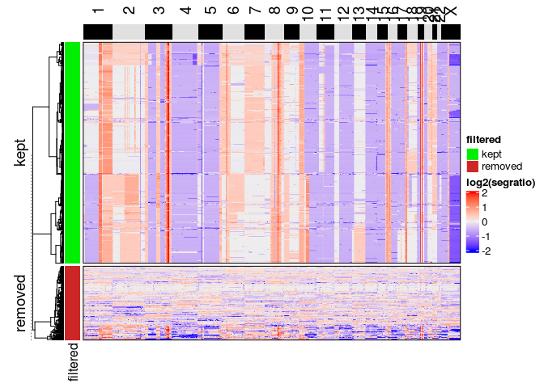
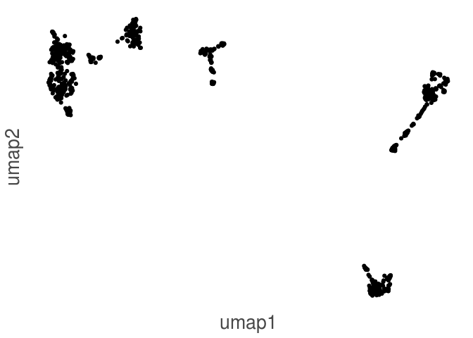
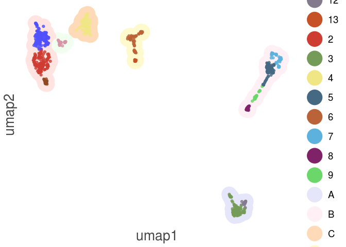
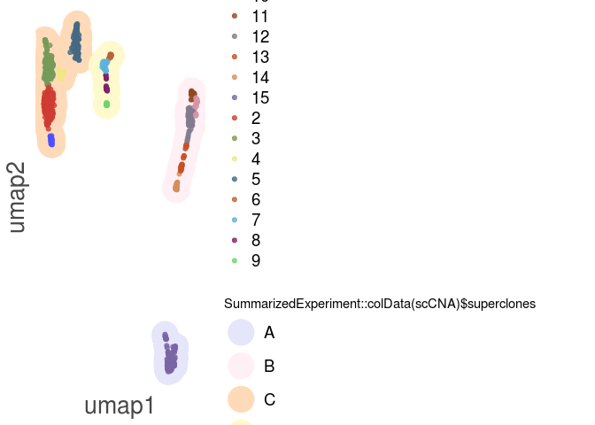

CopyKit Workflow
================

**CopyKit** provides a toolkit for the analysis of single-cell copy
number datasets. It includes functions to read data from
[Varbin](https://www.ncbi.nlm.nih.gov/pmc/articles/PMC4417119/) or [10X
CNA datasets](https://www.10xgenomics.com/solutions/single-cell-cnv/).

A common workflow with **CopyKit** consists in reading the dataset and
using to filter the noisy cells out, clustering and plotting heatmaps
for further analysis.

## Installation

You can install the development version of CopyKit from github with:

    devtools::install_github("navinlabcode/copykit")

# Getting Started

**CopyKit** provides a toolkit for the analysis of single-cell copy
number datasets. It includes functions to read data from
[Varbin](https://www.ncbi.nlm.nih.gov/pmc/articles/PMC4417119/) or [10X
CNA datasets](https://www.10xgenomics.com/solutions/single-cell-cnv/).

A common workflow with **CopyKit** consists in reading the dataset and
using to filter the noisy cells out, clustering and plotting heatmaps
for further analysis.

## Reading Varbin dataset

Datasets generated with the varbin pipeline can be read with the
function `readVarbinCNA()`. It creates an S4 class `scCNA` from the
output directory of the copy number pipeline. `readVarbinCNA()` searches
for the uber\*.seg uber.bin and uber.ratio files in the provided
directory.

The scCNA object will contain 3 different assays: **segment ratios**,
**ratios** and **bincounts** where each bin is row and each sample
(cell) is a column.

CopyKit stores the genomic ranges as a GRanges object containing
chromosome number, start coordinate, end coordinate and absolute genomic
position. Each row represents the coordinates for one bin.

It is possible to exclude the information from ChrY (important when
working with XX samples) by setting the argument `remove_Y` to `TRUE`.
Ex: `readVarbinCNA("~/path_to_varbin_output/", remove_Y = TRUE)`.

``` r
breast_tumor <- copykit::readVarbinCNA("~/path_to_varbin_output/")
```

    ## Importing segment ratios.

    ## Importing ratios.

    ## Importing bin counts.

    ## Removed ChrY information.

``` r
breast_tumor
```

    ## class: scCNA 
    ## dim: 12167 1442 
    ## metadata(0):
    ## assays(3): segment_ratios ratios bin_counts
    ## rownames(12167): 1 2 ... 12166 12167
    ## rowData names(6): bin_length gene_count ... gc_content abspos
    ## colnames(1442): tn20_2_s2_c10_s394_r1_001 tn20_2_s2_c11_s395_r1_001 ...
    ##   tn20_s6_c382_s2302_r1_001 tn20_s6_c383_s2303_r1_001
    ## colData names(1): sample
    ## reducedDimNames(0):
    ## spikeNames(0):
    ## rowRanges has: 12167 ranges
    ## Phylo:

**CopyKit** stores the bin information within a rowRanges object, which
can be accessed with `SummarizedExperiment::rowRanges()`:

``` r
SummarizedExperiment::rowRanges(breast_tumor)
```

    ## GRanges object with 12167 ranges and 6 metadata columns:
    ##         seqnames              ranges strand | bin_length gene_count cgi_count
    ##            <Rle>           <IRanges>  <Rle> |  <integer>  <integer> <integer>
    ##       1     chr1      977837-1200863      * |     223027         11        41
    ##       2     chr1     1200864-1455238      * |     254375         18        33
    ##       3     chr1     1455239-1758057      * |     302819         11        35
    ##       4     chr1     1758058-1989903      * |     231846          5        19
    ##       5     chr1     1989904-2211810      * |     221907          3        16
    ##     ...      ...                 ...    ... .        ...        ...       ...
    ##   12163     chrX 153835263-154107535      * |     272273          8         4
    ##   12164     chrX 154107536-154339310      * |     231775         12         4
    ##   12165     chrX 154339311-154639929      * |     300619          4         3
    ##   12166     chrX 154639930-154938160      * |     298231          1         3
    ##   12167     chrX 154938161-155180157      * |     241997          2         1
    ##         dist_telomere        gc_content      abspos
    ##             <integer>         <numeric> <integer64>
    ##       1       1146783 0.611899007743492      977837
    ##       2       1371964 0.592286977886868     1200864
    ##       3       1699329 0.545698915854107     1455239
    ##       4       1934728 0.541937320462544     1758058
    ##       5       2156893 0.570018070633446     1989904
    ##     ...           ...               ...         ...
    ##   12163       1227655 0.433821936071646  3034868549
    ##   12164        983007 0.395383453780725  3035140822
    ##   12165        749886 0.390856865334616  3035372597
    ##   12166        391320 0.380503703505117  3035673216
    ##   12167        155540 0.383103922776009  3035971447
    ##   -------
    ##   seqinfo: 24 sequences from an unspecified genome; no seqlengths

## Filtering cells.

Cells with low quality can be easily filtered with `filterCells()`.

`filterCells()` uses a k-nearest-neighbor approach to remove cells with
random CNA profiles, largely due to noise.

By default, **CopyKit** automatically outputs a heatmap so you can
visually assess if the filtering performed as expected, this however can
be turned off by adding the argument `filterCells(scCNA, plot_heatmap =
FALSE)`. Plotting the heatmap is a time consuming step due to distance
calculations. CopyKit also allows for parallel processing of the
distance calculations `filterCells()` with the argument `n_threads`.

To control how strict the filtering, change the argument `resolution`.
Ex: `filterCells(resolution = 0.9)`

``` r
breast_tumor <- copykit::filterCells(breast_tumor,
                                     resolution = 0.8)
```

    ## Calculating correlation matrix.

    ## Adding information to metadata. Access with SummarizedExperiment::colData(scCNA).

    ## Plotting heatmap.

    ## Your dataset has: 1442 Cells. Plotting heatmap may take a long time with large number of cells. Set number of threads with n_threads for parallel processing if possible to speed up.

    ## Done.

<!-- -->

The information is store as metadata and can be accessed with
`SummarizedExperiment::colData()`.

``` r
head(SummarizedExperiment::colData(breast_tumor))
```

    ## DataFrame with 6 rows and 2 columns
    ##                                              sample    filtered
    ##                                         <character> <character>
    ## tn20_2_s2_c10_s394_r1_001 tn20_2_s2_c10_s394_r1_001        kept
    ## tn20_2_s2_c11_s395_r1_001 tn20_2_s2_c11_s395_r1_001        kept
    ## tn20_2_s2_c12_s396_r1_001 tn20_2_s2_c12_s396_r1_001     removed
    ## tn20_2_s2_c13_s397_r1_001 tn20_2_s2_c13_s397_r1_001     removed
    ## tn20_2_s2_c14_s398_r1_001 tn20_2_s2_c14_s398_r1_001     removed
    ## tn20_2_s2_c19_s403_r1_001 tn20_2_s2_c19_s403_r1_001        kept

If you are satisfied with the filtering you can simply subset the object
based on the `SummarizedExperiment::colData(bt)$filtered`
column

``` r
breast_tumor <- breast_tumor[,SummarizedExperiment::colData(breast_tumor)$filtered == "kept"]
```

After subsetting it is recommended to calculate a distance matrix that
will be later passaged to functions such as `runPhylo()` or
`plotHeatmap()`. This distance matrix is stored in the scCNA object and
can be accessed with `distMat()`.

``` r
breast_tumor <- copykit::runDistMat(breast_tumor)
```

    ## Calculating distance matrix with metric: euclidean

    ## Using 48 cores.

    ## Access distance matrix with copykit::distMat()

    ## Done.

## Non-linear dimension reduction

We can explore the sample organization at reduced dimensions with
`runUmap()`. The goal is to explore the dataset for the presence of
different subpopulations. `runUmap()` stores the generated embedding
into the `scCNA` object and can be accessed with
`SingleCellExperiment::reducedDim(scCNA, 'umap', withDimnames = FALSE)`.
**CopyKit** uses the package `uwot` to generate the umap embedding, this
means that additional parameters that control the global or local
structure to `runUmap()` can be passed on with the `...` argument. Ex:
`runUmap(scCNA, min_dist = 0)`. To learn more on how those parameters
can control global and local structure embedding visit the [Umap
website](https://umap-learn.readthedocs.io/en/latest/clustering.html).
For the full list of possible parameters check `?uwot::umap`.

``` r
breast_tumor <- copykit::runUmap(breast_tumor,
                                 min_dist = 0,
                                 n_neighbors = 30)
```

    ## Embedding data with UMAP. Using seed 17

    ## Access reduced dimensions slot with: SingleCellExperiment::reducedDim(scCNA, 'umap').

    ## Done.

It is possivel to visualize the results with the function `plotUmap()`.

``` r
plotUmap(breast_tumor)
```

    ## No cluster information detected, use findClusters() to create it.

    ## Plotting Umap.

<!-- -->

# Finding clusters

**CopyKit** uses a graph based approacht to search for clusters in the
scCNA dataset. `findClusters()` builds an SNN graph of the k-nearest
neighbors and attempts to find two different level of clustering: Major
and minor subpopulations. Major clusters are found by looking at the
graph connected components, whereas minor clusters uses the Leiden
algorithm to detect connected communities within the major clusters. To
run `findClusters()` you first need `runUmap()`. **CopyKit** applies the
clustering on top of the UMAP embedding. Check
`?copykit::findClusters()` for help on how to change the clustering
parameters arguments.

``` r
breast_tumor <- copykit::findClusters(breast_tumor)
```

    ## Building SNN graph.

    ## Finding clusters.

    ## Done.

Clustering information is stored as metadata and can be accessed with
\`SummarizedExperiment::colData(scCNA).

``` r
head(SummarizedExperiment::colData(breast_tumor))
```

    ## DataFrame with 6 rows and 4 columns
    ##                                              sample    filtered major_clusters
    ##                                         <character> <character>    <character>
    ## tn20_2_s2_c10_s394_r1_001 tn20_2_s2_c10_s394_r1_001        kept              A
    ## tn20_2_s2_c11_s395_r1_001 tn20_2_s2_c11_s395_r1_001        kept              A
    ## tn20_2_s2_c19_s403_r1_001 tn20_2_s2_c19_s403_r1_001        kept              A
    ## tn20_2_s2_c2_s386_r1_001   tn20_2_s2_c2_s386_r1_001        kept              B
    ## tn20_2_s2_c20_s404_r1_001 tn20_2_s2_c20_s404_r1_001        kept              B
    ## tn20_2_s2_c21_s405_r1_001 tn20_2_s2_c21_s405_r1_001        kept              A
    ##                           minor_clusters
    ##                                <numeric>
    ## tn20_2_s2_c10_s394_r1_001              3
    ## tn20_2_s2_c11_s395_r1_001              3
    ## tn20_2_s2_c19_s403_r1_001             12
    ## tn20_2_s2_c2_s386_r1_001               8
    ## tn20_2_s2_c20_s404_r1_001              8
    ## tn20_2_s2_c21_s405_r1_001              3

`plotUmap()` will display cluster information if it is available.

``` r
plotUmap(breast_tumor)
```

    ## Plotting Umap.

    ## Using colData(scCNA) cluster information.

<!-- -->

# Running phylogenetic analysis

It is possible to run phylogenetic analysis with copykit by using the
function `runPhylo()`. This function creates a distance based
neighbor-joining tree that is stored within the scCNA object. You can
access the resulting tree with `phylo()`

``` r
breast_tumor <- copykit::runPhylo(breast_tumor)
```

    ## Creating neighbor-joining tree.

    ## Access slot with copykit::phylo(scCNA).

    ## Done.

Which can be easily visualized with

``` r
plot(phylo(breast_tumor), cex = 0.1)
```

<!-- -->

# Plotting heatmap

Plotting heatmap with **CopyKit** is done with the `plotHeatmap()`
function. By default `plotHeatmap()` orders the cells according to a
neighbor joining phylogenetic tree. `plotHeatmap()` also checks for the
existence of cluster information and will automatically add it as an
annotation to the heatmap if available.

``` r
copykit::plotHeatmap(breast_tumor)
```

# Visualize specific genes

It might be of interest to check for the heterogeneity in the number of
copies across all the samples for different genes. **CopyKit** provides
the function `geneCopyPlot()`.

``` r
copykit::geneCopyPlot(breast_tumor,
                      genes = c("KRAS",
                                "MYC",
                                "TP53",
                                "ERBB2"))
```

<!-- -->
